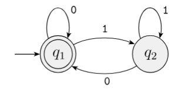
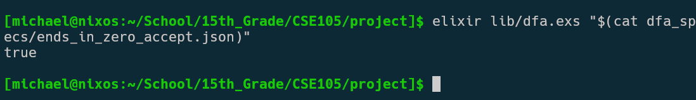
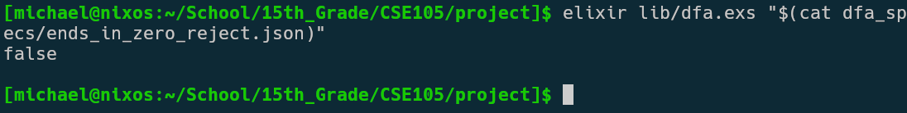
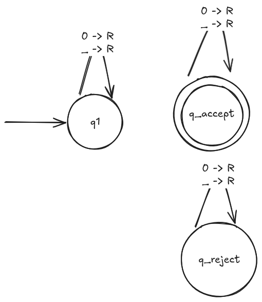
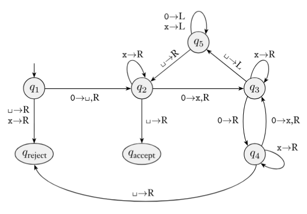
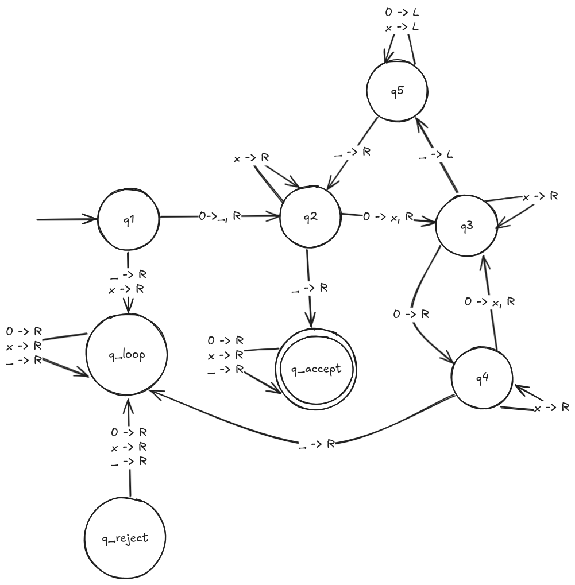
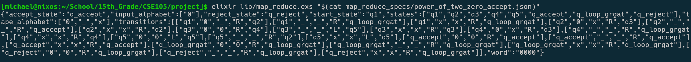
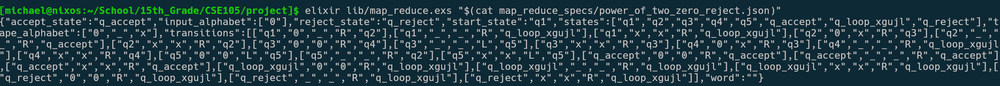

# Task 1: Illustrating Decidability of a Computational Problem
For this task I have chosen to illustrate the decidability of 
$A_{DFA} = \{ \langle B,w \rangle\ | B \text{ is a DFA that accepts string } w\}$.


## String Representation
For this problem I have decided to represent $\langle B,w \rangle = x$ where $B$ is a DFA and 
$w$ is a string over $B$'s alphabet as a JSON string with the following format:

```
{
    states: string[] 
    alphabet: char[]
    transitions: tuple<string, string, string>[]
    start_state: string
    accept_states: string[]
    word: string
}
```

`states` is an array of states in the DFA

`alphabet` is an array of characters in the DFA's alphabet 

`transitions` is an array of 3-tuples defining
the DFA's transition function where the first string is the
current state, the second string is the character being read,
and the third string is the output state.

`start_state` is the start state of the DFA 

`accept_states` is an array representing the set of acceptance states in the DFA

`word` is $w$, the string whose membership in $L(B)$ is being tested

## Parsing and Computation
The input string $x$ is parsed by first reading the JSON string into
a dictionary.

Then the program ensures that $x$ accurately represents $\langle B, w \rangle$
by making sure the `start_state` is a member of `states`,
`accept_states` is a subset of `states`, `word` is a string over
`alphabet`, and `transitions` defines the proper 
transitions such that all states have *exactly one* transition defined for every
member of the alphabet and the output of the
transition function is always a member of `states`, aka $\delta: Q \times \Sigma \to Q$.

After the input string $x$ is validated, the arrays are transformed to sets
and the transition function is represented as a adjacency-list like dictionary.

If any errors are thrown in the parsing and validation of $x$ the program halts
and returns `false` because that means $x \ne \langle B, w \rangle$.

If the input $x$ is valid, the program then simulates the computation of $B$ 
on $w$ and if the computation ends in an accept state the program returns
`true`, otherwise it returns `false`.

## Example Strings
For both of the following examples, the input string represents the following
DFA from example 1.9 in the textbook where 
$L(B) = \{w | w \text{ is the empty string or ends in 0}\}$. $B$ has
the following state diagram:



$\pagebreak$

### Accepted String
For an accepted string let $x = \langle B, w\rangle$ where $B$ is the 
DFA shown in Figure 1 and $w = 100$. Here is $x$:

```
{
    "states": ["q1", "q2"],
    "alphabet": ["0", "1"],
    "transitions": [
        ["q1", "0", "q1"],
        ["q1", "1", "q2"],
        ["q2", "1", "q2"],
        ["q2", "0", "q1"]
    ],
    "start_state": "q1",
    "accept_states": ["q1"],
    "word": "100"
}
```

$x \in A_{DFA}$ because it properly encodes $\langle B, w \rangle$ and
$w \in L(B)$ because $100$ ends
in 0. The computation of $B$ on $w$ has the following state transitions:
$q1 \to q2 \to q1 \to q1$ and since $q1$ is an accept state 
$B$ accepts $w$.

When running the program on this input $x$, we see the program correctly returns `true`.
Note that instead of typing the long JSON string manually, I have it saved to a file and am 
passing it in as a command line arg with `cat`.



### Rejected String
For a rejected string let $x = \langle B, w \rangle$ where $B$ is the 
DFA shown in Figure 1 and $w = 00001$. Here is $x$:

```
{
    "states": ["q1", "q2"],
    "alphabet": ["0", "1"],
    "transitions": [
        ["q1", "0", "q1"],
        ["q1", "1", "q2"],
        ["q2", "1", "q2"],
        ["q2", "0", "q1"]
    ],
    "start_state": "q1",
    "accept_states": ["q1"],
    "word": "00001"
}
```

$x \notin A_{DFA}$ because although it properly encodes 
$\langle B, w \rangle$, $w \notin L(B)$  because it ends in a 1.
The computation of $B$ on $w$ has the following state transitions:
$q1 \to q1 \to q1 \to q1 \to q1 \to q2$ and since $q2$ is not an
accepting state, $B$ rejects $x$.

When running the program on this input $x$, we see the program correctly returns `false`.
Note that instead of typing the long JSON string manually, I have it saved to a file and am 
passing it in as a command line arg with `cat`.



## Video Explanation
Watch the video [here](https://drive.google.com/file/d/1K4COR4XRZiL5YdFtcqDwM7mrDwHHy548/view?usp=sharing)

## Code
If you'd like to read the code in a better viewing format than PDF, visit the file on [GitHub](https://github.com/panda2k/cse105-project/blob/main/lib/dfa.exs)

```elixir
defmodule Project.DFA do
  @doc"""
  Parses a JSON string representing <B, w> where B is any DFA and w 
  is a string over the alphabet of B to run the computation on. From the string this
  validates M and gets the formal definition of states,
  alphabet, transition function, start state, and accept states while
  also validating the string w to run the computation on is valid

  ## JSON DFA Format 
  {
    states: string[] 
    alphabet: char[]
    transitions: tuple<string, string, string>[]
    start_state: string
    accept_states: string[]
    word: string
  }
  states is an array of states in the DFA
  alphabet is an array of characters in the DFA's alphabet 
  transitions is an array of 3-tuples defining
  the DFA's transition function where the first string is the
  current state, the second string is the character being read,
  and the third string is the output state
  start_state is the start state of the DFA 
  accept_states is an array representing the set of acceptance states in the DFA.
  word is the string whose membership in the DFA will be tested

  Returns the DFA with the arrays cast to sets and the transitions as an
  adjacency list as well as the input string w
  """
  def parse_dfa(input) do
    %{ 
      "states" => states,
      "alphabet" => alphabet,
      "transitions" => transitions,
      "start_state" => start_state,
      "accept_states" => accept_states,
      "word" => word 
    } = :json.decode(input)

    states = MapSet.new(states)
    alphabet = MapSet.new(alphabet)
    accept_states = MapSet.new(accept_states)
    # map the transition 3 tuples into an adjacency list
    transitions = Enum.reduce(transitions, %{}, fn [start, label, dest], acc -> 
      Map.update(
        acc,
        start,
        %{label => dest},
        fn existing -> 
          # if this state already has an existing transition with the same label (input char)
          # raise an error
          if Map.has_key?(existing, label) do
            raise "A state cannot have two transitions with the same label"
          end
          Map.put(existing, label, dest) 
        end
      ) 
    end) 

    # assert that all accept states are members of states, aka accept_states subseteq states
    if not MapSet.subset?(accept_states, states) do
      raise "All accept states must be members of the states array"
    end

    # assert that the start start is a member of states
    if not MapSet.member?(states, start_state) do
      raise "The start state must be a member of the state array"
    end

    # assert that every state has transition rules
    if not MapSet.equal?(states, transitions |> Map.keys |> MapSet.new) do
      raise "Every state must have transitions defined"
    end
    # assert that every state has a transition for every member of the alphabet and said transition maps to a valid state
    transitions 
      |> Map.values
      |> Enum.each(fn rules -> 
        # assert that the state's rules has a rule for each alphabet character
        if not MapSet.equal?(alphabet, rules |> Map.keys |> MapSet.new) do
          raise "There must be a transition defined for every alphabet character"
        end
        # assert that every destination in the rules is a valid state

        if not MapSet.subset?(rules |> Map.values |> MapSet.new, states) do
          raise "Every destination state must be a member of the state array"
        end
      end)

    # now the DFA input is guaranteed to be valid so assert that the input string
    # is valid
    word = String.graphemes(word)
    # assert that the input string only contains characters in the alphabet
    if not MapSet.subset?(word |> MapSet.new, alphabet) do
      raise "word must only contain characters defined in the alphabet list"
    end
    {states, alphabet, transitions, start_state, accept_states, word}
  end
  
  @doc"""
  Given the encoded <B, w>, decides whether w is in L(B)

  Assuming the input string is valid, the computation of it goes as follows:
  Start with the current state at start_state. Then, read the string right to left.
  For every character, modify the current state to be the result of the transition
  function with the current state and current character being read.
  After the string is processed, check if the current state is an accept state. If
  it is, accept, otherwise, reject.
  """
  def test_decidable(input) do 
    {_, _, transitions, start_state, accept_states, word} = parse_dfa(input) 
    
    # process input string
    end_state = Enum.reduce(word, start_state, fn character, state -> 
        Map.get(transitions, state) |> Map.get(character)
      end)
    MapSet.member?(accept_states, end_state)
  end

  def call do
    # if an error is thrown during the testing, return false (failed the typecheck)
    try do 
      test_decidable(System.argv() |> Enum.at(0, ""))
    rescue 
      _ -> false
    end
  end 
end

Project.DFA.call() |> IO.puts
```

# Task 2: Illustrating a Mapping Reduction
For this task I have chosen to illustrate the mapping reduction 
$A_{TM} \leq_m HALT_{TM}$ where 

$A_{TM} = \{\langle M, w \rangle | M \text{ is a Turing machine, } w \text{ is a string, and } w \in L(M)\}$

$HALT_{TM} = \{\langle M, w \rangle | M \text{ is a Turing machine, } w \text{ is a string, and } M \text{ halts on } w\}$


As defined in lecture both $A_{TM}$ and $HALT_{TM}$ are undecidable and
$A_{TM} \leq_m HALT_{TM}$ can be done with the function $F: \Sigma^* \to \Sigma^*$ 
defined as follows

$$
F = 
\begin{cases}  
const_{out} & \text{if } x \ne \langle M, w \rangle \text{ for any Turing machine } M \text{ and string } w \text{ over the alphabet of } M \\
\langle M', w \rangle & \text{if } x = \langle M, w \rangle \text{ for some Turing machine } M \text{ and string } w \text{ over the alphabet of } M \\
\end{cases}
$$

where $const_{out}$ is some constant $\langle M, w \rangle \notin HALT_{TM}$
and $M'$ is a Turing machine that computes like $M$ except if the computation
of $M$ were ever to go to a reject state, $M'$ loops instead.

## String Representation 
Similar to task 1, $\langle M, w \rangle$ is encoded as a JSON string with
the following format:

```
{
  states: string[] 
  input_alphabet: char[]
  tape_alphabet: char[]
  transitions: tuple<string, string, string, string, string>[]
  start_state: string
  accept_state: string
  reject_state: string
  word: string
}
```

`states` is an array of states in the Turing machine

`input_alphabet` is the array of characters in the Turing machine's input
alphabet

`tape_alphabet` is the array of characters in the Turing machine's tape
alphabet.

`transitions` is an array of 5 tuples specifying the Turing machine's
transition function where the first string is the input state,
the second string is the character being read, the third string is
the character to write, the fourth string is the direction to move
the tape head (either 'R' or 'L'), and the fifth string is the output state.

`start_state` is the Turing machine's starting state.

`accept_state` is the Turing machine's accept state.

`reject_state` is the Turing machine's reject state.

`word` is the input $w$, a string over the `input_alphabet`

## Parsing
Given the input string $x = \langle M, w \rangle$, the string
is first parsed as JSON into a dictionary.

The program then checks that $x = \langle M, w \rangle$ by making sure
`start_state` is a member of `states`, `input_alphabet` is a subset
of `tape_alphabet`, `accept_state` is a member of `states`, `reject_state` 
is a member of `states`, `word` is the string $w$ which is over
`input_alphabet` and `transitions` properly defines the transition
function such that all states have *exactly one* transition defined for every 
member of `tape_alphabet` and the transition is valid such that the
character being read/written is in the tape alphabet, the 
tape head is being moved either right or left, and the output state is a
member of `states`, aka $\delta: Q \times \Gamma \to Q \times \Gamma \times \{L, R\}$).

After the input string $x$ is validated, the arrays are transformed to sets
and the transition function is represented as a adjacency-list like dictionary.

If any errors are thrown in the parsing and validation of $x$ the program halts
and returns $const_{out}$.

For this program, $const_{out} = \langle A, \epsilon \rangle$ where $A$ has the following state diagram:

{ width=50% }

$A$ never halts because it loops on its starting state, which means that $\langle A, \epsilon \rangle \notin HALT_{TM}$,
therefore it is an appropriate value for $const_{out}$.

## Mapping
Assuming parsing went well, the input is then mapped from $\langle M, w \rangle \in A_{TM}$
to $\langle M', w \rangle \in HALT_{TM}$ with $F$.

A new state `loop_state` is added to the states and transition function
is modified such that on `loop_state` the computation will loop forever by defining the
transition rules such that
no matter what symbol is read, the Turing machine will leave the
tape unchanged, move the tape head right and stay on `loop_state`.

Then, for every transition in the transition function that goes
to `reject_state`, the transition is changed to go to `loop_state` instead.

This process produces $M'$ from $M$ and since $w$ is unchanged by $F$, the
program can then 
serialize $\langle M', w \rangle$ into the same JSON format as the input, output that string,
and halt.

## Examples
For both examples I'll use the following Turing machine $M$ from
the textbook figure 3.8.



This Turing machine $M$ decides $A = \{0^{2^n} | n \geq 0 \}$.

### Positive Instance
For a positive instance of a string $x = \langle M, w \rangle$ where
$M$ is a Turing machine and $w$ is a string over the Turing machine's
input alphabet, let's use the Turing machine defined in figure 5.

This Turing machine $M$ decides $A = \{0^{2^n} | n \geq 0 \}$
and the string $w$ I have chosen is $w = 0000 = 0^{2^2}$
such that $\langle M, w \rangle \in A_{TM}$ because $w \in L(A)$.
To show $w \in L(A)$, the computation of $w$ on $M$ goes as follows (read pointer is 0 indexed):

Tape: $0000\_ \_ \_$, State: $q1$, Read pointer in position 0 

Tape: $\_ 000\_ \_ \_$, State: $q2$, Read pointer in position 1 

Tape: $\_ x00\_ \_ \_$, State: $q3$, Read pointer in position 2

Tape: $\_ x00\_ \_ \_$, State: $q4$, Read pointer in position 3

Tape: $\_ x0x\_ \_ \_$, State: $q3$, Read pointer in position 4

Tape: $\_ x0x\_ \_ \_$, State: $q5$, Read pointer in position 3

Tape: $\_ x0x\_ \_ \_$, State: $q5$, Read pointer in position 2

Tape: $\_ x0x\_ \_ \_$, State: $q5$, Read pointer in position 1

Tape: $\_ x0x\_ \_ \_$, State: $q5$, Read pointer in position 0

Tape: $\_ x0x\_ \_ \_$, State: $q2$, Read pointer in position 1

Tape: $\_ x0x\_ \_ \_$, State: $q2$, Read pointer in position 2

Tape: $\_ xxx\_ \_ \_$, State: $q3$, Read pointer in position 3

Tape: $\_ xxx\_ \_ \_$, State: $q3$, Read pointer in position 4

Tape: $\_ xxx\_ \_ \_$, State: $q5$, Read pointer in position 3

Tape: $\_ xxx\_ \_ \_$, State: $q5$, Read pointer in position 2

Tape: $\_ xxx\_ \_ \_$, State: $q5$, Read pointer in position 1

Tape: $\_ xxx\_ \_ \_$, State: $q5$, Read pointer in position 0

Tape: $\_ xxx\_ \_ \_$, State: $q2$, Read pointer in position 1

Tape: $\_ xxx\_ \_ \_$, State: $q2$, Read pointer in position 2

Tape: $\_ xxx\_ \_ \_$, State: $q2$, Read pointer in position 3

Tape: $\_ xxx\_ \_ \_$, State: $q2$, Read pointer in position 4

Tape: $\_ xxx\_ \_ \_$, State: $q_{accept}$, Read pointer in position 5

The computation halts in $q_{accept}$, therefore $w \in L(M)$ and 
$\langle M, w \rangle \in A_{TM}$.

Given this $\langle M, w \rangle$, $x$ is the following JSON string:

```
{
    "states": ["q1", "q2", "q3", "q4", "q5", "q_accept", "q_reject"],
    "input_alphabet": ["0"],
    "tape_alphabet": ["0", "x", "_"],
    "transitions": [
        ["q1", "_", "_", "R", "q_reject"],
        ["q1", "x", "x", "R", "q_reject"],
        ["q1", "0", "_", "R", "q2"],

        ["q2", "_", "_", "R", "q_accept"],
        ["q2", "x", "x", "R", "q2"],
        ["q2", "0", "x", "R", "q3"],

        ["q3", "_", "_", "L", "q5"],
        ["q3", "x", "x", "R", "q3"],
        ["q3", "0", "0", "R", "q4"],

        ["q4", "_", "_", "R", "q_reject"],
        ["q4", "x", "x", "R", "q4"],
        ["q4", "0", "x", "R", "q3"],

        ["q5", "_", "_", "R", "q2"],
        ["q5", "x", "x", "L", "q5"],
        ["q5", "0", "0", "L", "q5"],

        ["q_accept", "_", "_", "R", "q_accept"],
        ["q_accept", "x", "x", "R", "q_accept"],
        ["q_accept", "0", "0", "R", "q_accept"],

        ["q_reject", "_", "_", "R", "q_reject"],
        ["q_reject", "x", "x", "R", "q_reject"],
        ["q_reject", "0", "0", "R", "q_reject"]
    ],
    "start_state": "q1",
    "accept_state": "q_accept",
    "reject_state": "q_reject",
    "word": "0000"
}
```

This is a positive input to the mapping reduction function because
$x = \langle M, w \rangle$ where $M$ is a well-defined Turing machine
and $w$ is a string over $M$'s input alphabet and $\langle M, w \rangle \in A_{TM}$.
Therefore this should
result in the JSON string $\langle M', w \rangle \in HALT_{TM}$ where $w$ is unchanged
from the input and $M'$ is a Turing machine that computes like $M$ except if the computation
of $M$ were ever to go to a reject state, $M'$ loops instead. $M'$ 
should have the following state diagram: 

{ width=50% }

$\langle M', w \rangle \in HALT_{TM}$ because running the computation of $M'$
on $w$ results in the following computations:

Tape: $0000 \_ \_ \_$, State: $q1$, Read pointer in position 0 

Tape: $\_ 000\_ \_ \_$, State: $q2$, Read pointer in position 1 

Tape: $\_ x00\_ \_ \_$, State: $q3$, Read pointer in position 2

Tape: $\_ x00\_ \_ \_$, State: $q4$, Read pointer in position 3

Tape: $\_ x0x\_ \_ \_$, State: $q3$, Read pointer in position 4

Tape: $\_ x0x\_ \_ \_$, State: $q5$, Read pointer in position 3

Tape: $\_ x0x\_ \_ \_$, State: $q5$, Read pointer in position 2

Tape: $\_ x0x\_ \_ \_$, State: $q5$, Read pointer in position 1

Tape: $\_ x0x\_ \_ \_$, State: $q5$, Read pointer in position 0

Tape: $\_ x0x\_ \_ \_$, State: $q2$, Read pointer in position 1

Tape: $\_ x0x\_ \_ \_$, State: $q2$, Read pointer in position 2

Tape: $\_ xxx\_ \_ \_$, State: $q3$, Read pointer in position 3

Tape: $\_ xxx\_ \_ \_$, State: $q3$, Read pointer in position 4

Tape: $\_ xxx\_ \_ \_$, State: $q5$, Read pointer in position 3

Tape: $\_ xxx\_ \_ \_$, State: $q5$, Read pointer in position 2

Tape: $\_ xxx\_ \_ \_$, State: $q5$, Read pointer in position 1

Tape: $\_ xxx\_ \_ \_$, State: $q5$, Read pointer in position 0

Tape: $\_ xxx\_ \_ \_$, State: $q2$, Read pointer in position 1

Tape: $\_ xxx\_ \_ \_$, State: $q2$, Read pointer in position 2

Tape: $\_ xxx\_ \_ \_$, State: $q2$, Read pointer in position 3

Tape: $\_ xxx\_ \_ \_$, State: $q2$, Read pointer in position 4

Tape: $\_ xxx\_ \_ \_$, State: $q_{accept}$, Read pointer in position 5

The computation of $w$ on $M'$ halts at $q_{accept}$, therefore 
$\langle M', w \rangle \in HALT_{TM}$

Upon running the code on this JSON input, we get the following JSON output: 



Note again how we use `cat` to avoid having to type the entire JSON input string and are able to read it from a file.

Here is the formatted JSON output so it is easier to read:

```
{
   "accept_state":"q_accept",
   "input_alphabet":[
      "0"
   ],
   "reject_state":"q_reject",
   "start_state":"q1",
   "states":[
      "q1", "q2", "q3", "q4", "q5", "q_accept", "q_loop_grgat", "q_reject"
   ],
   "tape_alphabet":["0", "_", "x"],
   "transitions":[
      ["q1", "0", "_", "R", "q2"],
      ["q1", "_", "_", "R", "q_loop_grgat"],
      ["q1", "x", "x", "R", "q_loop_grgat"],
      ["q2", "0", "x", "R", "q3"],
      ["q2", "_", "_", "R", "q_accept"],
      ["q2", "x", "x", "R", "q2"],
      ["q3", "0", "0", "R", "q4"],
      ["q3", "_", "_", "L", "q5"],
      ["q3", "x", "x", "R", "q3"],
      ["q4", "0", "x", "R", "q3"],
      ["q4", "_", "_", "R", "q_loop_grgat"],
      ["q4", "x", "x", "R", "q4"],
      ["q5", "0", "0", "L", "q5"],
      ["q5", "_", "_", "R", "q2"],
      ["q5", "x", "x", "L", "q5"],
      ["q_accept", "0", "0", "R", "q_accept"],
      ["q_accept", "_", "_", "R", "q_accept"],
      ["q_accept", "x", "x", "R", "q_accept"],
      ["q_loop_grgat", "0", "0", "R", "q_loop_grgat"],
      ["q_loop_grgat", "_", "_", "R", "q_loop_grgat"],
      ["q_loop_grgat", "x", "x", "R", "q_loop_grgat"],
      ["q_reject", "0", "0", "R", "q_loop_grgat"],
      ["q_reject", "_", "_", "R", "q_loop_grgat"],
      ["q_reject", "x", "x", "R", "q_loop_grgat"]
   ],
   "word":"0000"
}
```

As you can see this JSON output correctly represents the mapped string $\langle M', w \rangle$
with the outputted $M'$ having the same specifications and state diagram as drawn in Figure 6. Therefore
the program has correctly mapped this example $x = \langle M, w \rangle$ 
because $x = \langle M, w \rangle \in A_{TM} \iff F(x) = \langle M', w \rangle \in HALT_{TM}$
and since $\langle M, w \rangle \in A_{TM}$, the program has correctly outputted $F(x) = \langle M', w \rangle \in HALT_{TM}$.

Note that `loop_state` / $q_{loop}$ is `q_loop_grgat` because a random length-5 string
is appended to `q_loop_` just incase `q_loop` is already a state in $M$.

### Negative Instance
For a negative instance of a string $x = \langle M, w \rangle \notin A_{TM}$ where
$M$ is a Turing machine and $w$ is a string over the Turing machine's
input alphabet, take figure 3.8 from the textbook (Figure 5) with the input string $w = \epsilon$.

$\langle M, w \rangle \notin A_{TM}$ because the computation of $M$ on
$w$ halts in $q_{reject}$ through the following steps:

Tape: $\_ \_ \_$, State: $q1$, Read pointer in position 0 

Tape: $\_ \_ \_$, State: $q_{reject}$, Read pointer in position 1 

Given this $\langle M, w \rangle$, $x$ is the following JSON string:

```
{
    "states": ["q1", "q2", "q3", "q4", "q5", "q_accept", "q_reject"],
    "input_alphabet": ["0"],
    "tape_alphabet": ["0", "x", "_"],
    "transitions": [
        ["q1", "_", "_", "R", "q_reject"],
        ["q1", "x", "x", "R", "q_reject"],
        ["q1", "0", "_", "R", "q2"],

        ["q2", "_", "_", "R", "q_accept"],
        ["q2", "x", "x", "R", "q2"],
        ["q2", "0", "x", "R", "q3"],

        ["q3", "_", "_", "L", "q5"],
        ["q3", "x", "x", "R", "q3"],
        ["q3", "0", "0", "R", "q4"],

        ["q4", "_", "_", "R", "q_reject"],
        ["q4", "x", "x", "R", "q4"],
        ["q4", "0", "x", "R", "q3"],

        ["q5", "_", "_", "R", "q2"],
        ["q5", "x", "x", "L", "q5"],
        ["q5", "0", "0", "L", "q5"],

        ["q_accept", "_", "_", "R", "q_accept"],
        ["q_accept", "x", "x", "R", "q_accept"],
        ["q_accept", "0", "0", "R", "q_accept"],

        ["q_reject", "_", "_", "R", "q_reject"],
        ["q_reject", "x", "x", "R", "q_reject"],
        ["q_reject", "0", "0", "R", "q_reject"]
    ],
    "start_state": "q1",
    "accept_state": "q_accept",
    "reject_state": "q_reject",
    "word": ""
}
```

Same as the positive example, $M'$ should have the state diagram shown in Figure 6
when mapped with $F$.

$w$ should still be unchanged so we would get $\langle M', w \rangle$ which is not in $HALT_{TM}$ because
the computation of $M'$ on $w$ goes as follows:

Tape: $\_ \_ \_$, State: $q1$, Read pointer in position 0 

Tape: $\_ \_ \_$, State: $q_{loop}$, Read pointer in position 1 

Tape: $\_ \_ \_$, State: $q_{loop}$, Read pointer in position 2

Tape: $\_ \_ \_$, State: $q_{loop}$, Read pointer in position 3

This cycle would then continue on $q_{loop}$ forever and $M'$ would never halt on $w$, therefore making $\langle M', w \rangle \notin HALT_{TM}$.

Upon running the code on this JSON input, we get the following JSON output: 



Note again how we use `cat` to avoid having to type the entire JSON input string and are able to read it from a file.

Here is the formatted JSON output for easier reading:

```
{
   "accept_state":"q_accept",
   "input_alphabet":[
      "0"
   ],
   "reject_state":"q_reject",
   "start_state":"q1",
   "states":["q1", "q2", "q3", "q4", "q5", "q_accept", "q_loop_xgujl", "q_reject"],
   "tape_alphabet":["0", "_", "x"],
   "transitions":[
      ["q1", "0", "_", "R", "q2"],
      ["q1", "_", "_", "R", "q_loop_xgujl"],
      ["q1", "x", "x", "R", "q_loop_xgujl"],
      ["q2", "0", "x", "R", "q3"],
      ["q2", "_", "_", "R", "q_accept"],
      ["q2", "x", "x", "R", "q2"],
      ["q3", "0", "0", "R", "q4"],
      ["q3", "_", "_", "L", "q5"],
      ["q3", "x", "x", "R", "q3"],
      ["q4", "0", "x", "R", "q3"],
      ["q4", "_", "_", "R", "q_loop_xgujl"],
      ["q4", "x", "x", "R", "q4"],
      ["q5", "0", "0", "L", "q5"],
      ["q5", "_", "_", "R", "q2"],
      ["q5", "x", "x", "L", "q5"],
      ["q_accept", "0", "0", "R", "q_accept"],
      ["q_accept", "_", "_", "R", "q_accept"],
      ["q_accept", "x", "x", "R", "q_accept"],
      ["q_loop_xgujl", "0", "0", "R", "q_loop_xgujl"],
      ["q_loop_xgujl", "_", "_", "R", "q_loop_xgujl"],
      ["q_loop_xgujl", "x", "x", "R", "q_loop_xgujl"],
      ["q_reject", "0", "0", "R", "q_loop_xgujl"],
      ["q_reject", "_", "_", "R", "q_loop_xgujl"],
      ["q_reject", "x", "x", "R", "q_loop_xgujl"]
   ],
   "word":""
}
```

As you can see this JSON output correctly represents the mapped string $\langle M', w \rangle$
with the outputted $M'$ having the same specifications and state diagram as drawn in Figure 6. Therefore
the program has correctly mapped this example $x = \langle M, w \rangle$ 
because $x = \langle M, w \rangle \in A_{TM} \iff F(x) = \langle M', w \rangle \in HALT_{TM}$ means that
since $x \notin A_{TM}$, the program has correctly outputted $F(x) = \langle M', w \rangle \notin HALT_{TM}$.

Note that `loop_state` / $q_{loop}$ is `q_loop_xgujl` because a random length-5 string
is appended to `q_loop_` just incase `q_loop` is already a state in $M$.

## Video Explanation
Watch the video [here](https://drive.google.com/file/d/1tQZrZ3KLmUfWAijA374Y2W3_7WYxzhbG/view?usp=sharing)

## Code
If you'd like to read the code in a better viewing format than PDF, visit the file on [GitHub](https://github.com/panda2k/cse105-project/blob/main/lib/map_reduce.exs)

```elixir
defmodule Project.MapReduce do
  @doc"""
  Parses a json string representing <M, w> where M is a Turing machine and
  w is a string over M's input alphabet. Parses the JSON string to validate M and
  to get the formal definition of states,
  input + tape alphabet, transition function, start state, and accept state, and
  reject state while also validating the input string w is valid.

  ## JSON Turing Machine Format 
  {
    states: string[] 
    input_alphabet: char[]
    tape_alphabet: char[]
    transitions: tuple<string, string, string, string, string>[]
    start_state: string
    accept_state: string
    reject_state: string
    word: string
  }
  states is an array of states in the Turing machine
  input_alphabet is an array of characters in the Turing machines input alphabet
  tape_alphabet is an array of characters in the Turing machines tape alphabet
  transitions is an array of 5-tuples defining
  the Turing machine's transition function where the first string is the
  input state, the second string is the character being read,
  and the third string is the character to write, the fourth string
  is the direction to move the tape head ('R' | 'L') and the fifth string is the
  output state.
  start_state is the start state of the Turing machine
  accept_state is the accepting state of the Turing machine
  reject_state is the rejecting state of the Turing machine
  word is the string input to the Turing machine

  Returns the Turing machine with the arrays cast to sets and the transitions as an
  adjacency list as well as the input string w
  """
  def parse_tm(input) do 
    %{
      "states" => states,
      "input_alphabet" => input_alphabet,
      "tape_alphabet" => tape_alphabet,
      "transitions" => transitions,
      "start_state" => start_state,
      "accept_state" => accept_state,
      "reject_state" => reject_state,
      "word" => word 
    } = :json.decode(input)

    states = MapSet.new(states)
    input_alphabet = MapSet.new(input_alphabet)
    tape_alphabet = MapSet.new(tape_alphabet)
    head_directions = MapSet.new(["L", "R"])

    # map the transition [start state, read character, write character, tape direction, end state]
    transitions = Enum.reduce(transitions, %{}, fn [start, read, write, dir, dest], acc -> 
      Map.update(
        acc,
        start,
        %{ read => {write, dir, dest} },
        fn existing -> 
          # if this state already has an existing transition with the read character
          # raise an error
          if Map.has_key?(existing, read) do
            raise "A state cannot have two transitions with the same read character"
          end
          Map.put(existing, read, {write, dir, dest})
        end
      )
    end)

    # assert that the input alphabet is a subset of the tape alphabet
    if not MapSet.subset?(input_alphabet, tape_alphabet) do
      raise "The input alphabet must be a subset of the tape alphabet"
    end

    # assert that the accept state is in the states
    if not MapSet.member?(states, accept_state) do
      raise "The accept state must be a member of the states array"
    end
    # assert that the reject state is in the states
    if not MapSet.member?(states, reject_state) do
      raise "The reject state must be a member of the states array"
    end
    # assert that the start state is in the states
    if not MapSet.member?(states, start_state) do
      raise "The start state must be a member of the states array"
    end
    # assert that every state has transition rules
    if not MapSet.equal?(states, transitions |> Map.keys |> MapSet.new) do
      raise "Every state must have transitions defined"
    end
    # assert that every state has a transition for every member of the tape alphabet
    transitions 
      |> Map.values
      |> Enum.each(fn rules ->
        # assert that the state's rules has a rule for each tape character
        if not MapSet.equal?(tape_alphabet, rules |> Map.keys |> MapSet.new) do
          raise "Each state must have a transition defined for each member of the tape alphabet" 
        end
        # assert that every destination in the rules is a valid state
        if not MapSet.subset?(rules |> Map.values |> Enum.map(fn { _, _, dest } -> dest end) |> MapSet.new, states) do
          raise "The destination of a state transition must be a valid state in the state array"
        end
        # assert that every write character is valid in tape alphabet
        if not MapSet.subset?(rules |> Map.values |> Enum.map(fn { write, _, _} -> write end) |> MapSet.new, tape_alphabet) do
          raise "The character being written to tape must be a member of the tape alphabet"
        end
        # assert that every tape direction is either L or R
        if not MapSet.subset?(rules |> Map.values |> Enum.map(fn { _, dir, _} -> dir end) |> MapSet.new, head_directions) do
          raise "The tape head direction must be either 'R' or 'L'"
        end
      end)
    
    # now that tm is valid, assert that the input string only contains char from input alphabet
    word = String.graphemes(word)
    if not MapSet.subset?(word |> MapSet.new, input_alphabet) do
      raise "The word must only contain characters form the input alphabet"
    end

    {states, input_alphabet, tape_alphabet, transitions, start_state, accept_state, reject_state, word}
  end

  @doc"""
  The inverse of parse_tm where it takes the outputs and can serialize
  them back to the JSON format specified above.
  """
  def serialize_tm({states, input_alphabet, tape_alphabet, transitions, start_state, accept_state, reject_state, word}) do 
    %{
      "states" => states |> MapSet.to_list,
      "input_alphabet" => input_alphabet |> MapSet.to_list,
      "tape_alphabet" => tape_alphabet |> MapSet.to_list,
      "transitions" => transitions 
        |> Enum.flat_map(fn {start, rules} -> 
          Enum.map(rules, fn { read, { write, dir, dest } } -> 
            [start, read, write, dir, dest]
          end)
        end),
      "start_state" => start_state,
      "accept_state" => accept_state,
      "reject_state" => reject_state,
      "word" => word |> Enum.join
    } |> :json.encode
  end

  @doc"""
  For usage in generating the looping state in the mapping reduction. 
  Given the set of existing states and a prefix, returns a new state
  "<prefix>_<random 5 characters>" that doesn't already exist in the
  set of states. 
  """
  def new_state(states, prefix) do
    random_state = for _ <- 1..5, into: "#{prefix}_", do: <<Enum.random(?a..?z)>>
    if MapSet.member?(states, random_state) do
      new_state(states, prefix)
    else
      random_state 
    end
  end

  @doc"""
  Maps the Turing machine acceptance problem to the halting problem
  Given the input <M,w>, maps to <M', w> with the technique discussed in 
  class where if a computation were ever to go to the reject state,
  it would loop instead. Outputs <M', w> in the same input string format
  if the input is valid.
  """
  def map_reduce(input) do
    {
      states, 
      input_alphabet,
      tape_alphabet,
      transitions,
      start_state,
      accept_state,
      reject_state,
      word,
    } = parse_tm(input)
    # make a new loop state 
    loop_state = new_state(states, "q_loop")
    states = MapSet.put(states, loop_state)
    
    # for every edge that goes to the reject state, go to a new loop state
    transitions = transitions 
      |> Enum.reduce(%{}, fn {start, rules}, acc -> 
          rules = Enum.reduce(rules, %{}, fn { read, { write, dir, dest } }, acc -> 
            if dest == reject_state do
              # if going to reject state, redirect to loop state
              Map.put(acc, read, {write, dir, loop_state})
            else
              # if not going to reject state, leave it unchanged
              Map.put(acc, read, {write, dir, dest }) 
            end
          end)
          Map.put(acc, start, rules)
        end)
      |> Map.put(loop_state, Enum.reduce(tape_alphabet, %{}, fn char, acc -> 
        # now add in the transitions for the loop state, basically for
        # every character in the tape alphabet loop back to loop_state
        # leave the tape unchanged and move the tape head right
        Map.put(acc, char, {char, "R", loop_state})
      end))

    # output the formatted new turing machine
    serialize_tm({states, input_alphabet, tape_alphabet, transitions, start_state, accept_state, reject_state, word})
  end

  @doc"""
  Calls map_reduce with the first command line argument to this script.
  If an error is thrown that means parsing failed, aka <M, w> is not a valid
  representation of a Turing machine and input string over M's input
  alphabet. In this case, const_tm is outputted which is not a member
  of HALT_TM. If no error is thrown it returns the mapping of <M, w> from
  A_TM to HALT_TM.
  """
  def call do 
    try do
      map_reduce(System.argv() |> Enum.at(0, ""))
    rescue
      _ -> {
        # if an error is thrown during the map reduction that means parsing failed
        # so lets return a constant which is not in halt_tm. we will use a TM
        # that loops on the start state forever
        MapSet.new(["q_start", "q_acc", "q_rej"]),
        MapSet.new(["0"]),
        MapSet.new(["0", "_"]),
        %{
          "q_start" => %{
            "0" => { "0", "R", "q_start" },
            "_" => { "_", "R", "q_start" }
          },
          "q_acc" => %{
            "0" => { "0", "R", "q_acc" },
            "_" => { "_", "R", "q_acc" }
          },
          "q_rej" => %{
            "0" => { "0", "R", "q_rej" },
            "_" => { "_", "R", "q_rej" }
          }
        },
        "q_start",
        "q_acc",
        "q_rej",
        "",
      } |> serialize_tm()
    end
  end
end

Project.MapReduce.call |> IO.puts
```

